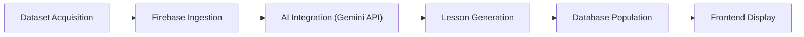

# 🧠 AI Data Acquisition & Generation Pipeline

*A streamlined system for transforming CSV data into structured multiple-choice learning content.*

---

## Overview

This pipeline converts manually curated CSV datasets into interactive lessons using **Firebase** and **Gemini API**.  
Each lesson contains a **description** that defines the learning context, and Gemini generates **four possible answers** — one correct and three incorrect — based on that description.

Although it appears simple, the system handles complex validation, AI output control, and data consistency beneath the surface.

---

## 🔄 Pipeline Summary

| Stage | Description |
|--------|-------------|
| **1. Dataset Acquisition** | Prepare or collect topic-based CSV datasets. |
| **2. Firebase Ingestion** | Upload CSVs into Firebase via Firefoo to create structured collections. |
| **3. AI Integration (Gemini API)** | Generate 10 levels × 5 lessons per topic from dataset descriptions. |
| **4. Lesson Generation** | Each lesson includes description, difficulty, and four answers (1 correct). |
| **5. Database Population** | Store generated lessons back into Firebase collections. |
| **6. Frontend Display** | Display topics, levels, and lessons dynamically to users. |

---

## ⚙️ Detailed Workflow

### 1️⃣ Dataset Acquisition

Data is prepared manually in **CSV format**, each representing a topic.

**Example structure:**
```csv
id,title,description,category
1,Renewable Energy,How solar panels convert sunlight into electricity,Environment
2,Carbon Emissions,How CO₂ impacts global temperature,Climate
```

---

### 2️⃣ Firebase Ingestion

CSVs are uploaded to **Firebase** via **Firefoo**.

Each row becomes a document with fields such as title and description.

**Example structure:**
```
/topics
  ├── renewable_energy
  │   ├── title: "Renewable Energy"
  │   ├── description: "How solar panels convert sunlight into electricity"
  ├── carbon_emissions
      ├── title: "Carbon Emissions"
      ├── description: "How CO₂ impacts global temperature"
```

---

### 3️⃣ AI Integration (Gemini API)

The **Gemini API** connects to Firebase, processes topic data, and generates structured content.

For each topic, Gemini creates:

- **10 levels**
- **5 lessons per level**
- Each lesson includes:
  - **Description** (base text)
  - **Difficulty** (*easy*, *intermediate*, *expert*)
  - **Four answers:** one correct, three incorrect

**Example:**
```
Lesson Description: How solar panels convert sunlight into electricity  
Difficulty: Intermediate  
Answers:  
✅ Photovoltaic cells convert sunlight into electricity.  
❌ Mirrors reflect sunlight to generate heat.  
❌ Wind turbines capture moving air to create power.  
❌ Batteries convert stored chemical energy into light.
```

> The AI’s job is to interpret the description and generate plausible but distinct answer options — ensuring only one is factually correct.

---

### 4️⃣ Lesson Generation

After AI processing, each topic expands into:

```
Topics → Levels → Lessons → Answers[]
```

Each lesson has:
- A **description** field  
- A **difficulty** label  
- An array of four **answer objects** (one correct, three incorrect)

> This approach keeps lessons lightweight while retaining meaningful evaluation logic for learners.

---

### 5️⃣ Database Population

The generated content is pushed back into **Firebase**:

```
/topics/renewable_energy/levels/2/lessons/1
  ├── description: "How solar panels convert sunlight into electricity"
  ├── difficulty: "Intermediate"
  ├── answers:
  │   ├── A: "Photovoltaic cells convert sunlight into electricity." (correct)
  │   ├── B: "Mirrors reflect sunlight to generate heat."
  │   ├── C: "Wind turbines capture moving air to create power."
  │   ├── D: "Batteries convert stored chemical energy into light."
```

> Even though the structure is compact, it requires strong data validation to prevent malformed or duplicate lessons.

---

### 6️⃣ Frontend Display

The frontend dynamically reads topics, levels, and lessons from Firebase.

Each lesson displays:
- The **description**
- **Four selectable answers**
- Visual indicators for correct/incorrect selections

> This ensures seamless interactivity and scalable lesson generation as more datasets are added.

---

## 🧩 Data Flow Diagram



---

## ⚠️ Hidden Complexity

Even this simplified system involves advanced control mechanisms:

- **AI Output Validation** — Ensuring Gemini always generates four valid options with exactly one correct.  
- **Data Integrity** — Maintaining consistent Firebase schemas and difficulty labels.  
- **Scalability** — Efficiently handling thousands of lessons and answer pairs.  
- **Version Control** — Managing updates without overwriting manually verified data.  
- **Quality Assurance** — Auto-detecting nonsensical or duplicate answers.

> The pipeline may look linear, but it operates like a micro-orchestrated system balancing AI creativity with structural discipline.

---

## 🏁 Conclusion

This AI-powered pipeline turns simple CSV rows into structured, quiz-style lessons stored in Firebase.  
By maintaining a minimalist design and strong data integrity rules, it achieves both scalability and precision — making it a deceptively simple yet powerful educational content engine.
