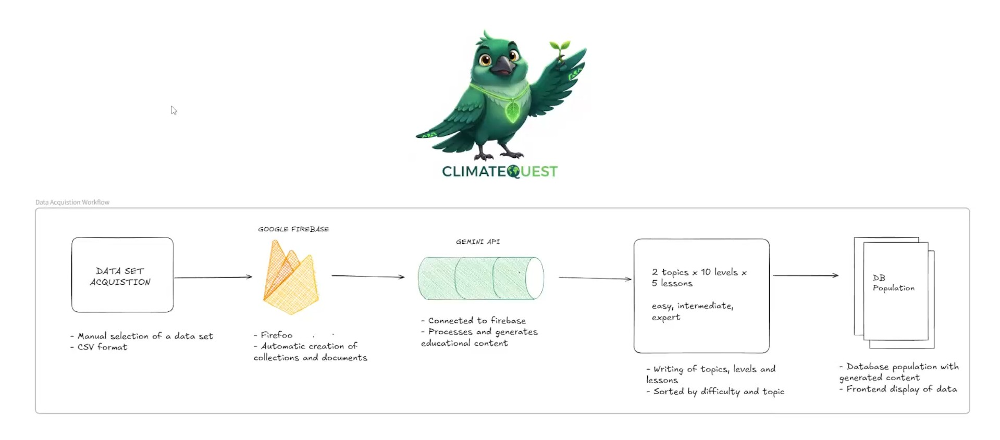
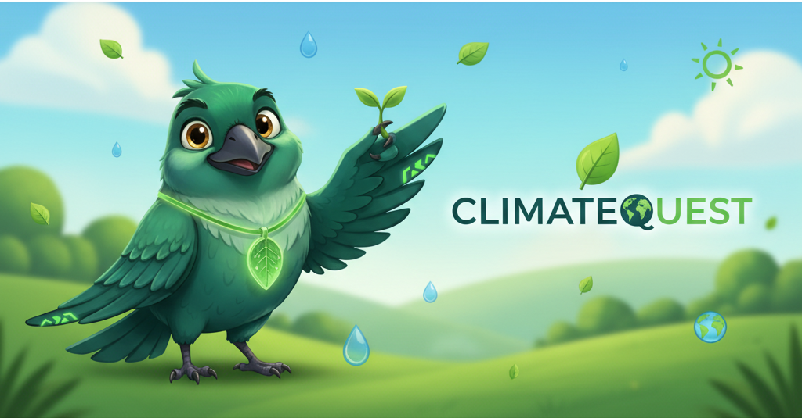

# 🌍 ClimaQuest – Gamified Climate Education Platform  
**Learn. Act. Impact.**  
Transforming climate education into an interactive, AI-powered learning experience.

---

## 🎥 Demo Video  
🎬 **Watch the full pitch & demo on Vimeo:**  
👉 [https://vimeo.com/1135122047?share=copy&fl=sv&fe=ci#t=0](https://vimeo.com/1135122047?share=copy&fl=sv&fe=ci#t=0)

---

## 🌿 About the Project  

**ClimaQuest** is an interactive educational platform that makes learning about climate change fun, visual, and data-driven.  
It combines **real environmental datasets**, **AI-generated content**, and **gamified progression** to help users explore climate topics, complete quizzes, and earn achievements while deepening their understanding of global sustainability issues.

### ✨ Key Features
- 🧭 **Level-Based Learning Map** – Progress through interactive climate topics such as E-Waste and Global Temperature Change.  
- 🤖 **AI-Generated Lessons & Quizzes** – Gemini API summarizes datasets and creates fact-checked multiple-choice questions.  
- 🏅 **Gamification Layer** – Earn EcoPoints, unlock badges, and track learning streaks.  
- 📊 **Dataset Integration** – Connects open climate data sources to meaningful educational content.  
- 👥 **Profiles & Achievements** – View personal stats, completed levels, and rewards.  
- 📽️ **Educational Reels** – Short, social-style clips generated from real climate data.

---

## 🧩 Inspiration  

We started ClimaQuest in **Sarajevo** after a simple conversation over coffee:  
> “How do we make climate facts actually stick?”  

Growing up in Bosnia, we saw rivers and parks change over time — and realized the issue isn’t a lack of data, but a lack of **connection**.  
So we built ClimaQuest: a platform that teaches with data, but plays like a game.

---

## ⚙️ Tech Stack  

| Layer | Technologies |
|--------|---------------|
| **Frontend** | React + Tailwind + Firebase (Firestore, Auth, Storage) |
| **Backend / AI** | Gemini API (AI text generation), Firebase Cloud Functions |
| **Data Sources** | UNEP E-Waste dataset, NASA Global Temperature dataset |
| **Design & Tools** | Lovable (rapid UI generation), Figma, Canva |
| **Deployment** | Firebase Hosting + GitHub integration |

---

## 🧠 Data Pipeline Overview  

This project includes an **AI-driven data acquisition and content generation pipeline**.  
It converts curated CSV datasets into structured quiz-style lessons using Firebase and Gemini API.



For detailed explanation, see the full [DATA_PIPELINE.md](./DATA_PIPELINE.md).

**Summary Flow:**  
CSV Dataset → Firebase Collections → Gemini AI → Lesson Generation → Database Population → Frontend Display

Each dataset is transformed into:
- 2 topics × 10 levels × 5 lessons each  
- Lessons include difficulty levels (*easy, intermediate, expert*)  
- Each lesson = 1 description + 4 answers (1 correct, 3 distractors)

---

## 👨‍💻 Team Verde Codice  

| Member | Role | Focus |
|--------|------|--------|
| **Nijaz Andelić** | AI & Product Lead | AI integration, dataset logic, system architecture |
| **Alen Bejtić** | Frontend Developer | React UI, Firebase integration, and visual polish |
| **Tarik** | UX/UI & Data Integration | Lovable prototyping, data visualization, design |

---

## 🧪 Test Account  
You can explore the live demo using this test login:
```
Email: tarik@test.com
Password: 12345678
```


> Use this account to try levels, quizzes, and see the EcoPoints system in action.

---

## 📸 Visual Highlights  

### 🌐 Application Interface  


### 🧠 Data Pipeline Diagram  


### 👥 Team Verde Codice  


### 🌿 Tarik – Frontend / Design  


---

## 🚧 Challenges We Faced  
- Integrating AI outputs into a dynamic Firebase schema.  
- Designing a level system that feels like a *game*, not a form.  
- Handling inconsistent dataset entries while keeping the flow seamless.  
- Maintaining visual clarity across mobile and desktop.

---

## 💡 What We Learned  
We discovered how to merge **data, design, and motivation** — balancing factual content with engaging UX.  
We also gained practical experience in **prompt engineering**, **Firebase integration**, and **AI validation**.

---

## 🚀 What’s Next  
- 🌎 Add more datasets and climate topics.  
- 📱 Launch a mobile-friendly PWA version.  
- 🧭 Introduce leaderboards and community challenges.  
- 🌱 Measure real-world impact via EcoPoint ↔ action mapping (e.g., tree planting, recycling events).  

---

## 📬 Links  

- 🔗 **Devpost Submission:** [https://devpost.com/software/climaquest](https://devpost.com/software/climaquest)  
- 💻 **GitHub Repository:** [https://github.com/rikta5/clima-quest-bloom](https://github.com/rikta5/clima-quest-bloom)  
- 🎥 **Demo Video:** [Vimeo Pitch & Demo](https://vimeo.com/1135122047?share=copy&fl=sv&fe=ci#t=0)

---

## 📄 License  
This project is licensed under the **MIT License**.  
Feel free to fork, learn, and contribute to improving climate education through gamification.

---

> “Education should empower — not overwhelm.  
> ClimaQuest turns awareness into action, and learning into impact.”


## LOVABLE README

# Welcome to your Lovable project

## Project info

**URL**: https://lovable.dev/projects/a94bd93e-9289-4fab-83ad-ece41c413144

## How can I edit this code?

There are several ways of editing your application.

**Use Lovable**

Simply visit the [Lovable Project](https://lovable.dev/projects/a94bd93e-9289-4fab-83ad-ece41c413144) and start prompting.

Changes made via Lovable will be committed automatically to this repo.

**Use your preferred IDE**

If you want to work locally using your own IDE, you can clone this repo and push changes. Pushed changes will also be reflected in Lovable.

The only requirement is having Node.js & npm installed - [install with nvm](https://github.com/nvm-sh/nvm#installing-and-updating)

Follow these steps:

```sh
# Step 1: Clone the repository using the project's Git URL.
git clone <YOUR_GIT_URL>

# Step 2: Navigate to the project directory.
cd <YOUR_PROJECT_NAME>

# Step 3: Install the necessary dependencies.
npm i

# Step 4: Start the development server with auto-reloading and an instant preview.
npm run dev
```

**Edit a file directly in GitHub**

- Navigate to the desired file(s).
- Click the "Edit" button (pencil icon) at the top right of the file view.
- Make your changes and commit the changes.

**Use GitHub Codespaces**

- Navigate to the main page of your repository.
- Click on the "Code" button (green button) near the top right.
- Select the "Codespaces" tab.
- Click on "New codespace" to launch a new Codespace environment.
- Edit files directly within the Codespace and commit and push your changes once you're done.

## What technologies are used for this project?

This project is built with:

- Vite
- TypeScript
- React
- shadcn-ui
- Tailwind CSS

## How can I deploy this project?

Simply open [Lovable](https://lovable.dev/projects/a94bd93e-9289-4fab-83ad-ece41c413144) and click on Share -> Publish.

## Can I connect a custom domain to my Lovable project?

Yes, you can!

To connect a domain, navigate to Project > Settings > Domains and click Connect Domain.

Read more here: [Setting up a custom domain](https://docs.lovable.dev/features/custom-domain#custom-domain)
